# 🛒 Smart Retail System

A modern PHP-based e-commerce and retail management platform featuring user authentication, product browsing, dynamic cart management, order processing, and a full admin dashboard.

---

## 🚀 Features

Customer Features
- 🔍 Product Catalog (search, categories, filtering, autocomplete search)
- 🛒 Shopping Cart with dynamic stock validation
- 💳 Checkout System (multi-step, secure)
- 📦 Order Tracking & history
- 👤 User Authentication (login & registration)
- 📱 Responsive UI for mobile & desktop

Admin Features
- 📊 Admin Dashboard with analytics
- 📦 Product Management (add, edit, delete)
- 🗂 Order Management (update order states)
- 🏷 Category Management
- 👥 User & Role Management
- 🔐 Role-Based Access Control (RBAC)

---

## 🛠️ Tech Stack

- **Backend** - PHP (OOP), MySQL (PDO)
- **Frontend** - HTML5, CSS3, JavaScript (ES6)
- **Styling** - Custom CSS (Flexbox / Grid)
- **Security** - Auth Sessions, Sanitization, Role-Based Access
- **APIs** - Internal PHP API endpoints

---

## 📁 Project Structure

```
smart-retail
├── api
│   ├── auth
│   │   ├── login-api.php
│   │   └── register-api.php
│   ├── products-autocomplete.php
│   └── stock-check.php
├── assets
│   ├── css
│   │   ├── auth.css
│   │   └── style.css
│   └── js
│       ├── auth.js
│       ├── cart.js
│       ├── dashboard.js
│       ├── dynamic-cart.js
│       ├── enhanced-features.js
│       ├── search-autocomplete.js
│       └── stock-validator.js
├── config
│   ├── config.php
│   └── database.php
├── dashboard.php
├── docs
│   └── .project_structure_ignore
├── index.php
├── login.php
├── logout.php
├── models
│   ├── Cart.php
│   ├── Category.php
│   ├── Order.php
│   ├── Product.php
│   └── User.php
├── README.md
├── register.php
├── sql
│   ├── sample.sql
│   └── schema.sql
├── utils
│   └── Auth.php
└── views
    ├── admin
    │   ├── admin-dashboard.php
    │   ├── manage-orders.php
    │   └── manage-products.php
    ├── cart
    │   ├── cart-remove.php
    │   ├── cart.php
    │   ├── checkout.php
    │   └── order-success.php
    ├── categories
    │   └── category.php
    ├── order
    │   └── orders.php
    └── products
        └── products.php
```

---

## 🔐 Authentication & Role Management

**User Roles**
- Customer – Browse, buy, track orders
- Admin – Manage products, orders, users
- Sales/Staff – Fulfillment & inventory

**Security Features**
- ✔ Password hashing
- ✔ SQL Injection prevention (PDO prepared statements)
- ✔ XSS protection (output sanitization)
- ✔ Session-based authentication
- ✔ RBAC with Auth.php

---

## 🗄️ Database Schema (Core Tables)

- **users** – authentication, roles
- **products** – product data
- **categories** – product grouping
- **orders** – order metadata
- **order_items** – order line items
- **cart** – temporary user cart
- **roles** – RBAC structure

SQL files provided:
```
- sql/sample.sql  
- sql/schema.sql
```
---

## ⚙️ Installation Setup
**1. Congfigure Database**
- Create a MySQL database
- Import sql/schema.sql

**2. Update Config File**
- config/config.php:

define('DB_HOST', 'localhost');
define('DB_NAME', 'smart_retail');
define('DB_USER', 'root');
define('DB_PASS', '');

**3. Start the Server**
- http://localhost/smart-retail/index.php

---

### 📱 Usage Guide

**Customer**
- View products
- Add to cart
- Checkout
- View order history

**Admin**
- Manage inventory
- Modify orders
- View system stats
- Maintain categories

---

### API Endpoints (Internal)
| Endpoint | Method | Purpose |
|----------|----------|----------|
| /api/auth/login-api.php | POST | User login|
| /api/auth/register-api.php | POST | User signup|
| /api/products-autocomplete.php | GET | Live search | 
| /api/stock-check.php | POST | Cart stock validation | 

## 📱 Preview
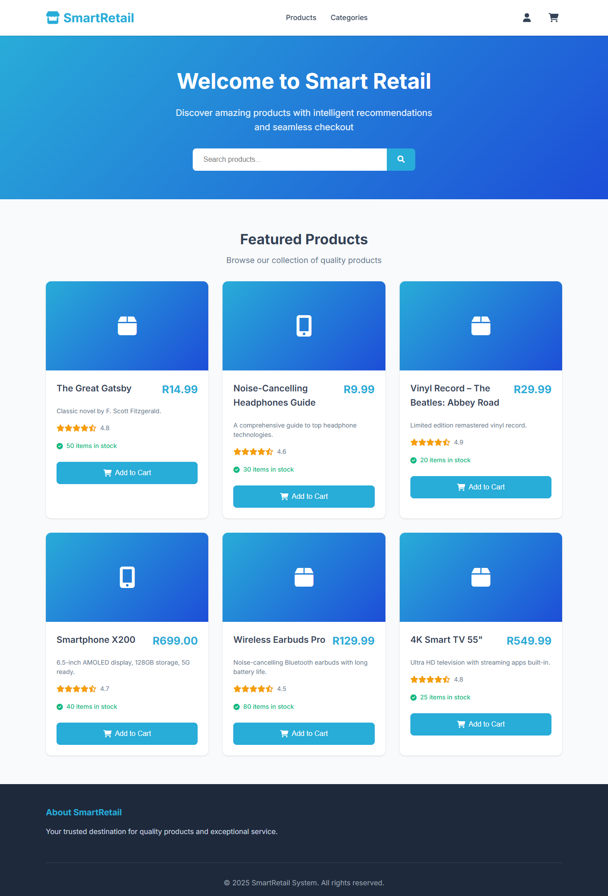 <br>
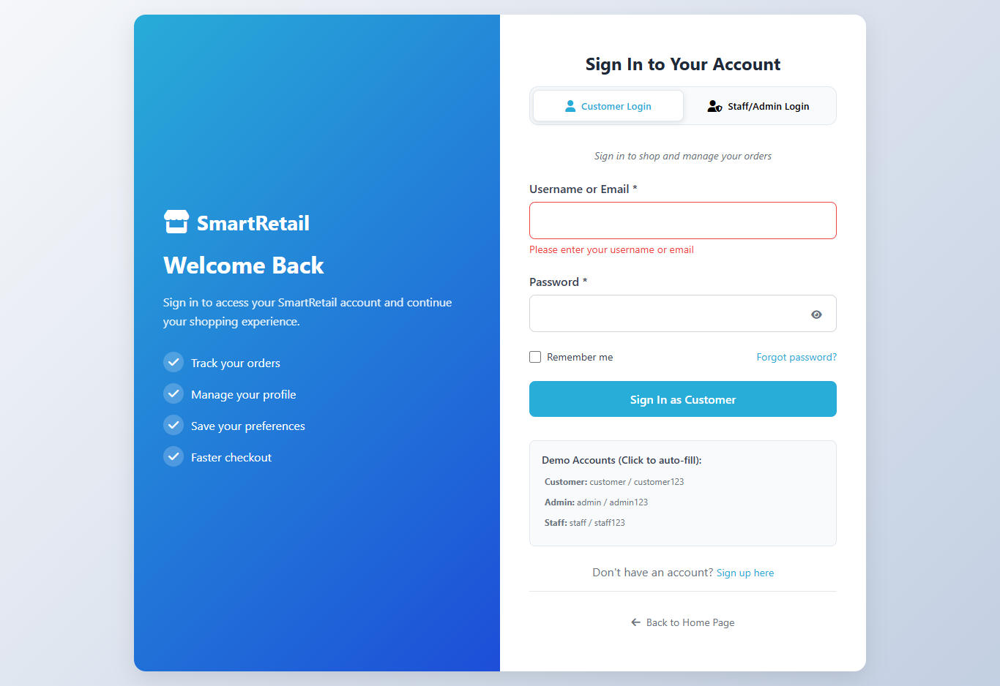 <br>
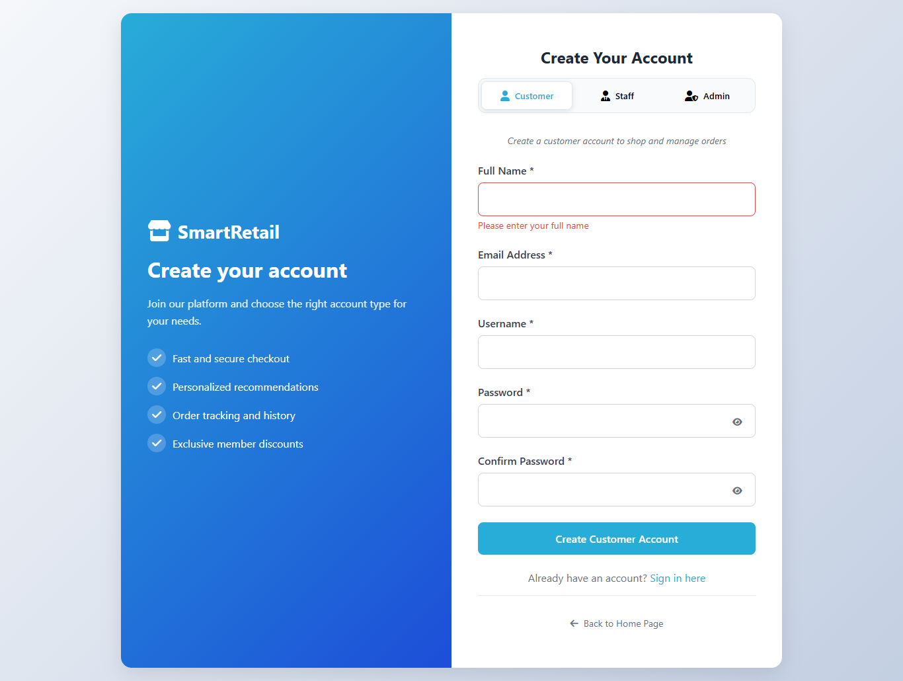 <br>
 <br>
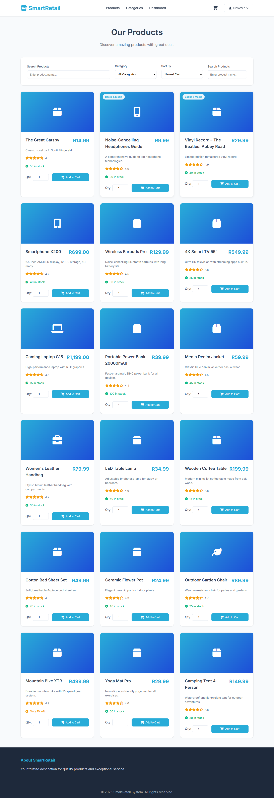 <br>
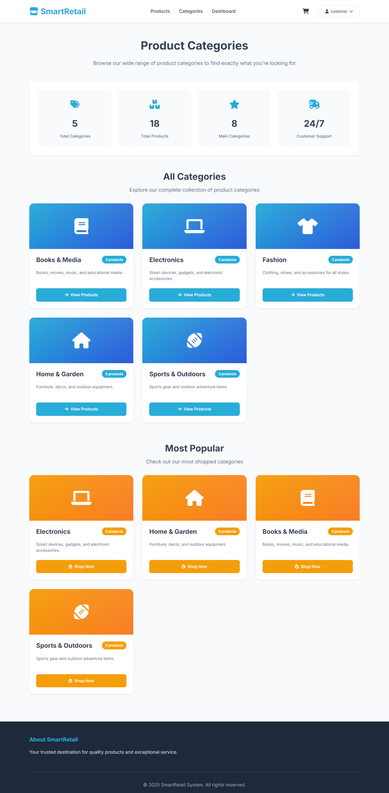 <br>
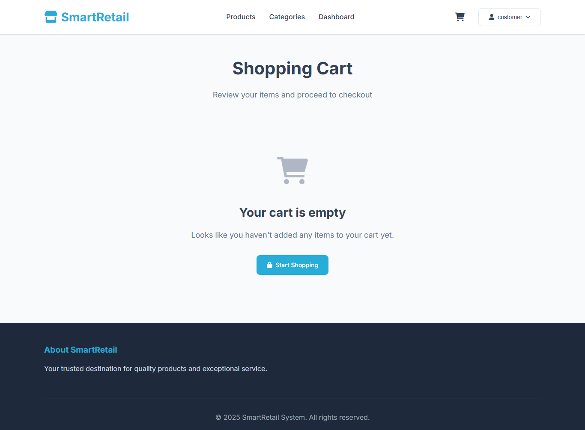 <br>
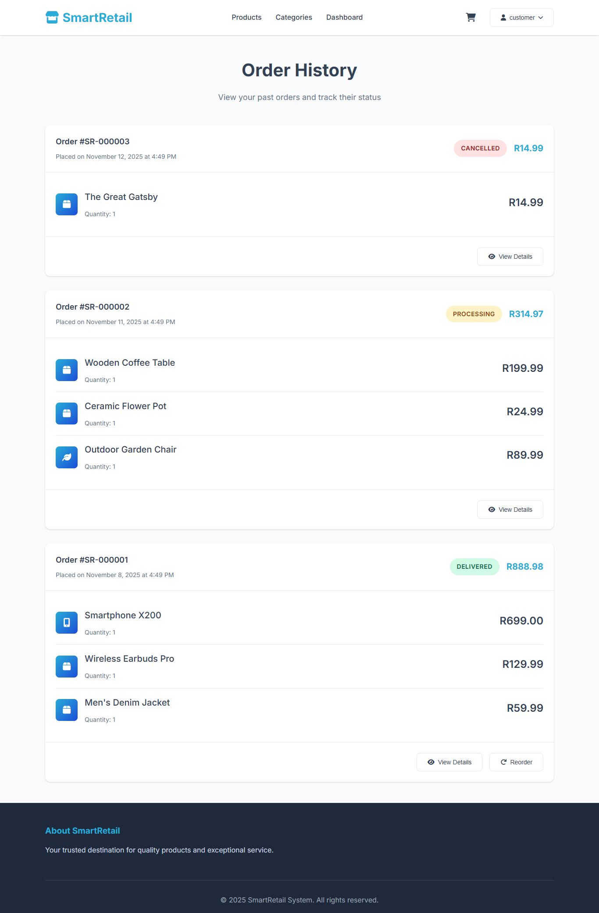 <br>
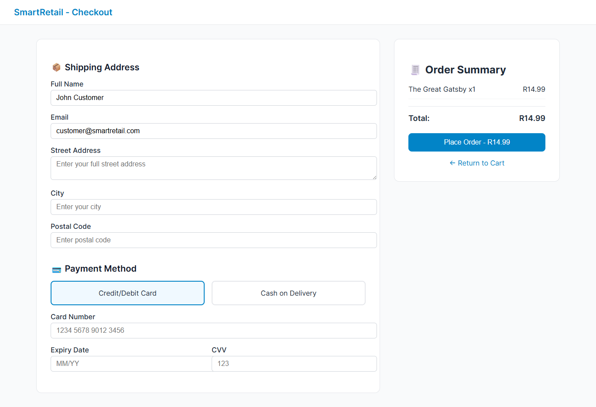 <br>
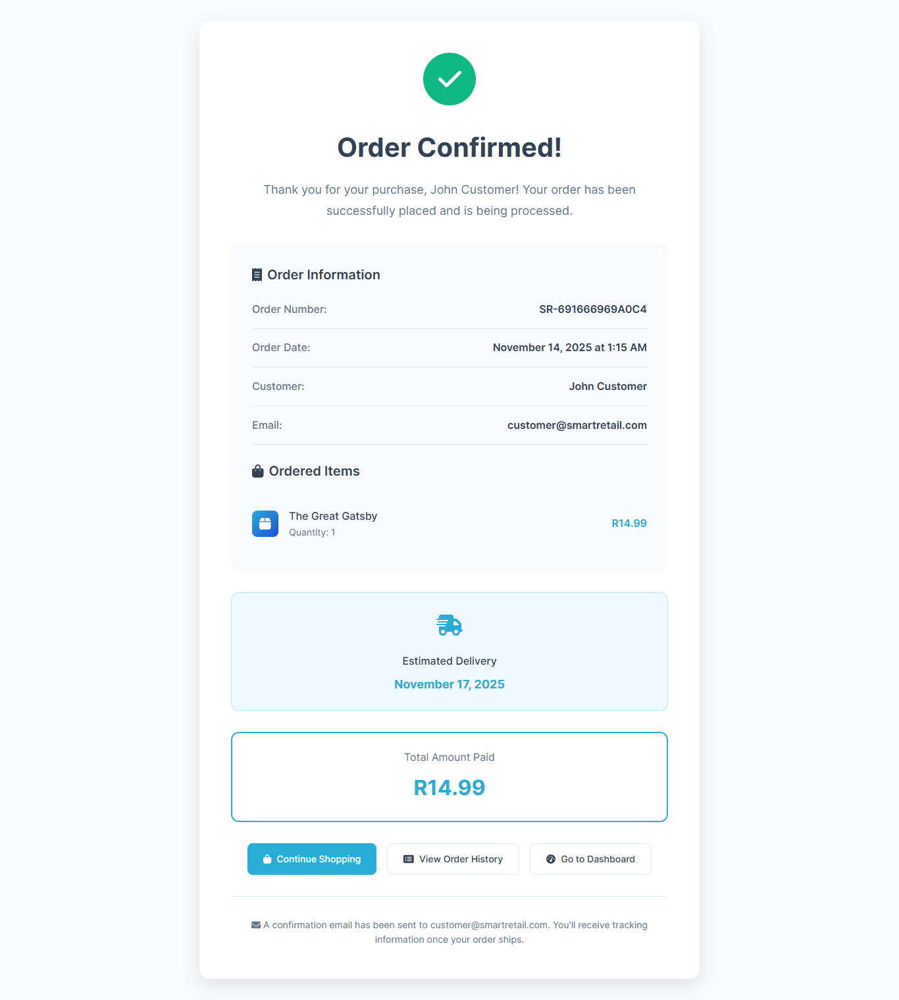 <br>
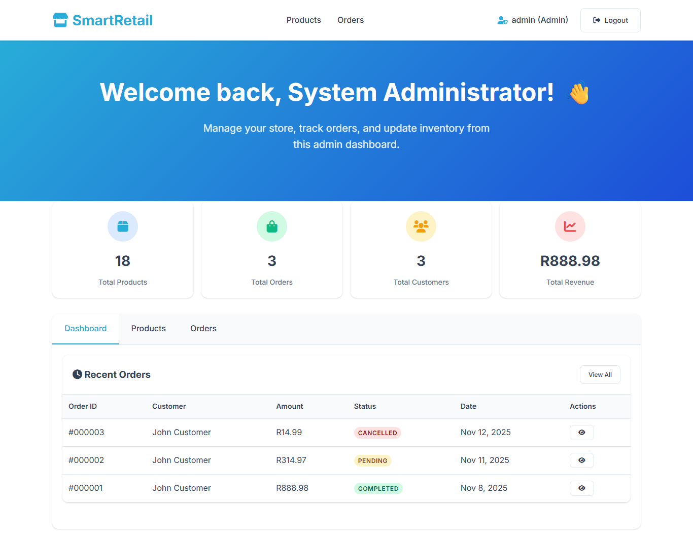 <br>
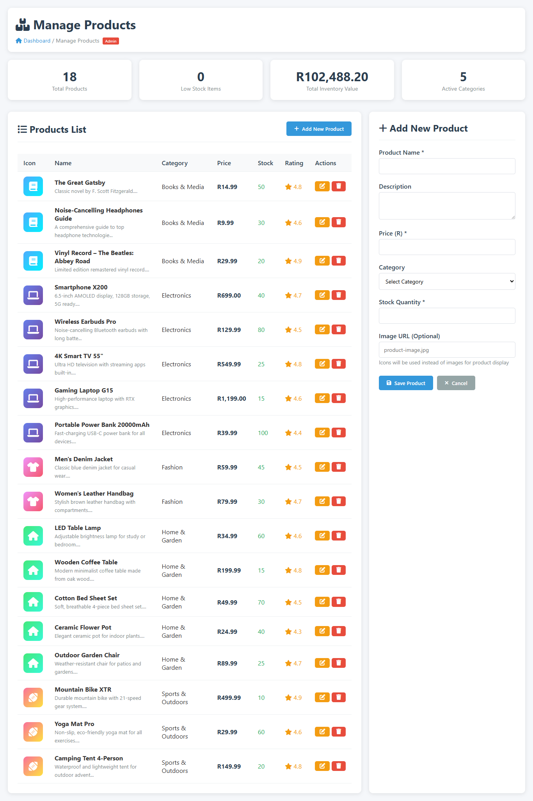 <br>
 


